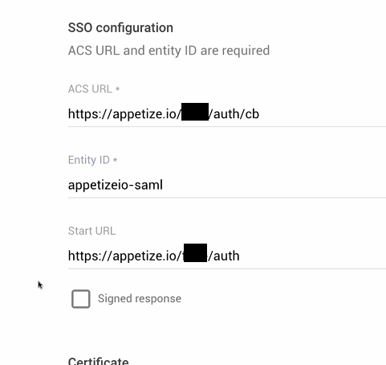
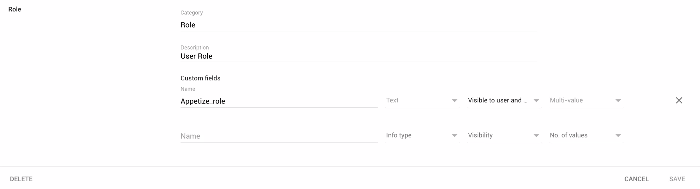
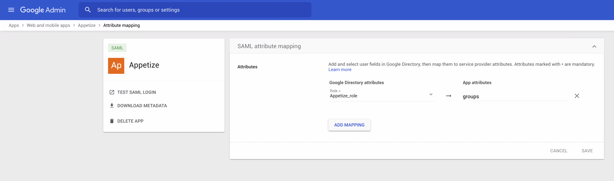

# Google Workspace (GSuite)

For setup instructions, we recommend clients first follow our SAML instructions here:


[saml.md](saml.md)


Once basic SAML integration has been set up, there are a few additional steps required in order for a user's assigned roles to be contained in the SAML response from your server.

## SSO configuration in Google Workspace

<figure><figcaption>
ACS URL and Start URL will be provided by Appetize.io
</figcaption></figure>

## Configure a new Role on the user object

<figure><figcaption>
Define the Appetize_role (or name it as you wish)
</figcaption></figure>

## Map the newly defined role to the App attribute "groups"

<figure><figcaption>
Map user role to "groups" attribute
</figcaption></figure>
