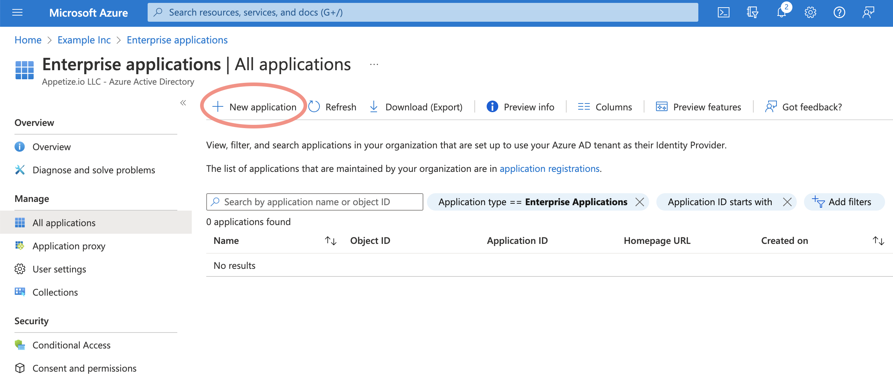
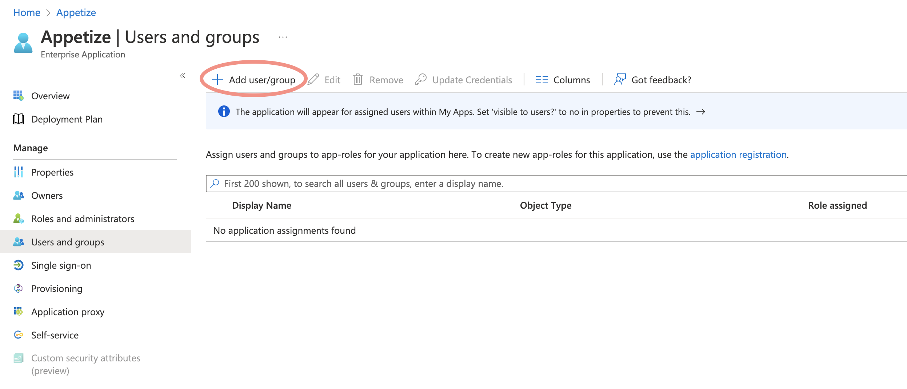
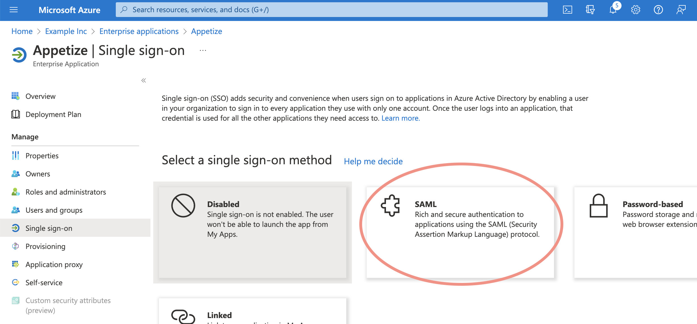
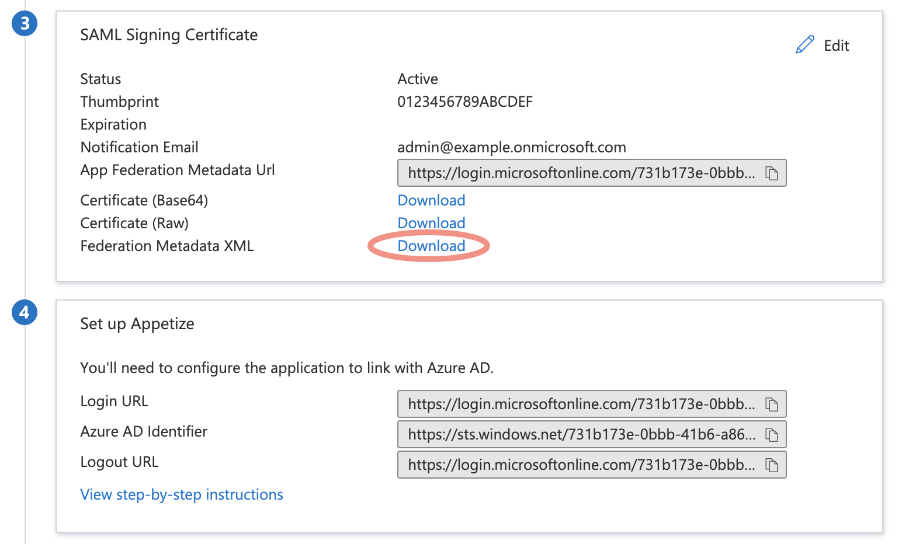

# Azure Active Directory

Appetize.io supports Azure Active Directory as an SSO provider, using the SAML protocol.&#x20;

### Prerequisites

Please have the entity ID (usually `appetizeio-saml`) and the Assertion Consumer Service URL (looks like `https://appetize.io/sso/example/cb`) you received from Appetize support.

### Azure Active Directory Setup

In Azure Active Directory, go to Enterprise Applications. Create a new application. Choose a name for it (e.g. Appetize) and select "Integrate any other application you don't find in the gallery (Non-gallery).

With the App created, click on "App roles". Create a role named "Appetize Admin" with value `appetize_admin`, and another role named "Appetize Developer" with value `appetize_developer`.

Return to "Enterprise Applications" and choose "Appetize". Click "Users and groups" to authorize logging in. Click "Add user/group" and choose from your organization's existing users or groups. Select a role (Appetize Admin, Developer, or User) as appropriate. Save the assignment.

Click "Single sign-on" and click "SAML". Enter the entity ID and Assertion Consumer Service URL provided by Appetize support.

On the next page, click the edit button next to "Attributes & Claims". Click "Add a new claim". Name: groups, Source: attribute, Source attribute: user.assignedroles. Save the claim.

Return the SAML page and download the "Federation Metadata XML" file. Send this file to Appetize support. Alternative, you may send the Certificate (Base64) and the Login URL.

Appetize will provision SSO for your account after receiving the information. If necessary, we may also schedule a call to test the integration.
