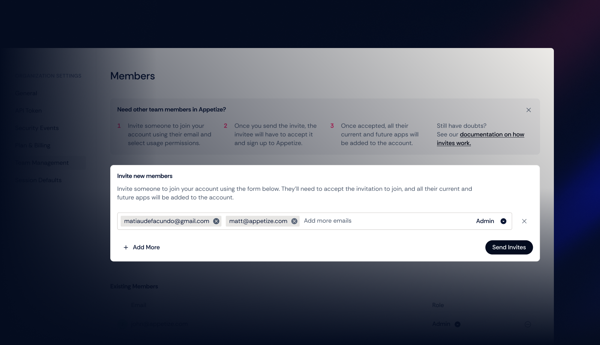

# OpenID Connect

_Note: Every SSO provider is a little bit different. Please_ [_contact us_](mailto:hello@appetize.io) _with any questions!_

### Create a new application

### Configure app settings

| Field | Value |
| :--- | :--- |
| Allowed grant types | Authorization Code |
| Login redirect URIs | TBD - specified by Appetize.io |
| Initiate login URI | TBD - specified by Appetize.io |

### Add group assignments to claims

We will need to configure your SSO provider to send over the user's groups assignments after a successful login. 

The following example shows how to pass through groups with prefix appetize\_\* as a groups claim within OKTA. This can be done by adding the groups claim to your authorization server at API -&gt; Authorization Servers. For some OKTA clients, this can also be done under the "Sign On" section in your app's configuration, where you can add groups the same way. 

### **Provide client information to Appetize.io**

1. We will need the "Client ID" and "Client secret" for the app you just created. 

2. We will also need your metadata endpoint, often called "Discovery URL". For example: [https://dev-548472.oktapreview.com/oauth2/default/.well-known/oauth-authorization-server](https://dev-548472.oktapreview.com/oauth2/default/.well-known/oauth-authorization-server)

If the metadata endpoint is not available, you may also specify the required fields below:

* authorization\_endpoint
* token\_endpoint
* userinfo\_endpoint
* jwks\_uri
* issuer
* introspection\_endpoint. 

