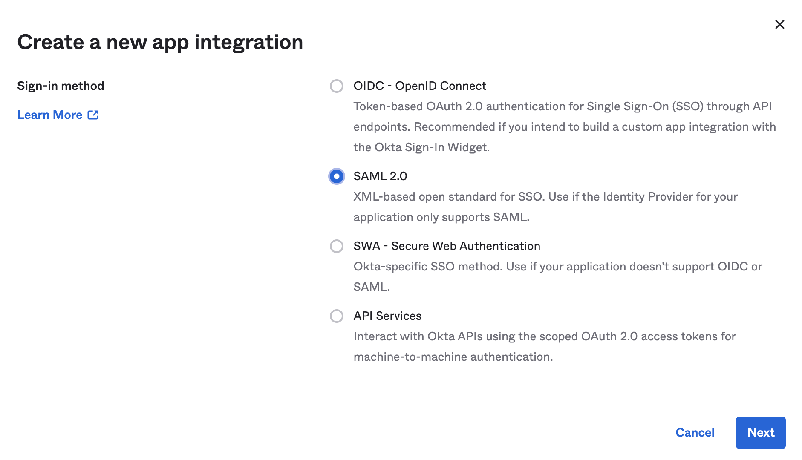
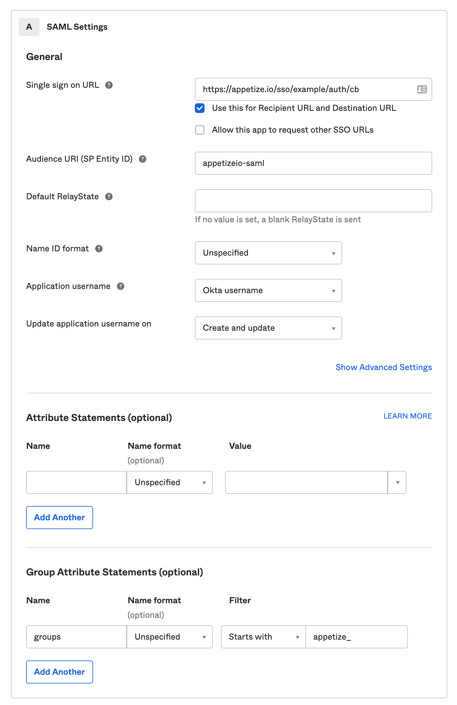
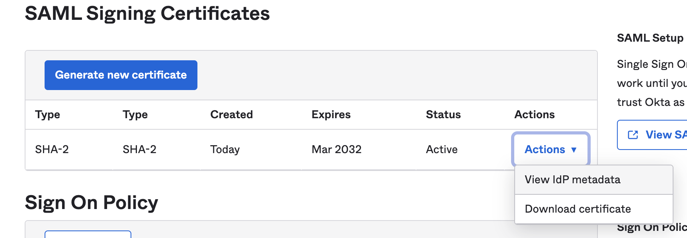

# SAML

_Note: Every SSO provider is a little bit different. Please_ [_contact us_](mailto:hello@appetize.io) _with any questions!_

### Configure app settings

Please ensure that the user's email address is sent as the username in the SAML response.&#x20;

Please create group assignments for `appetize_developer` and `appetize_admin`, and assign to users appropriately. All users who have access to the SAML app, with no group assignments, will default to the user role. Please ensure these group assignments are passed in the SAML response as an attribute named `groups`.

| Field                                | Value                            |
| ------------------------------------ | -------------------------------- |
| SP Entity Id / Audience URI          | appetizeio-saml                  |
| Assertion Consumer Service URL (ACS) | TBD - provided by Appetize.io    |
| Recipient URL                        | N/A - leave blank or same as ACS |
| Destination URL                      | N/A - leave blank or same as ACS |

### **Information to provide to Appetize.io**

* entryPoint - the URL from your service provider that will initiate a login.
* x509 certificate used to sign SAML responses
* Note: your provider may provide an IdP metadata file that contains both the entryPoint and the certificate. You may send that file to us.
* authentication context (optional) - usually necessary for Microsoft ADFS
* signature algorithm (default SHA256)
* which identify provider are you using? (ADFS, OKTA, etc)

### Example Configuration with OKTA

