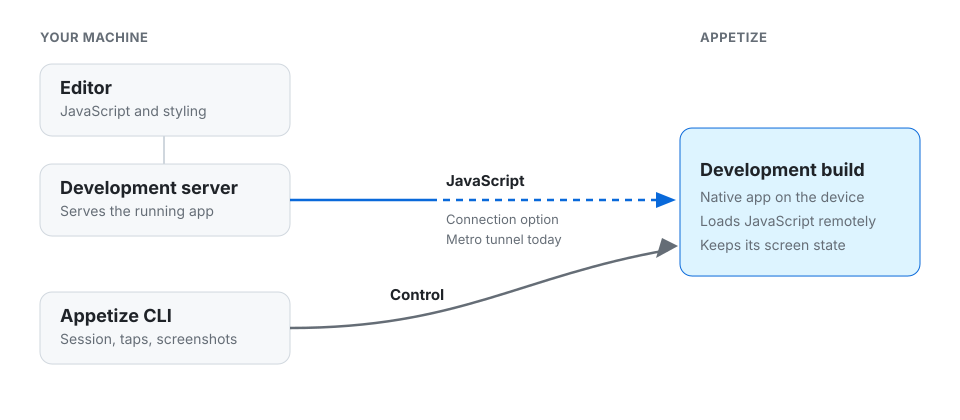

# AI live editing

The app is already running. Save a file. The screen updates. Look, then save again.

That does not need a new build.

<figure><figcaption>
The blue path is the save. The gray path is you, or an agent, driving the device.
</figcaption></figure>

The save goes through a connection. [Metro](metro.md) is one, for React Native. The CLI starts the session and can tap the screen. It does not send the file.

Use a development build. A release build will not pick up the save.

## Connections

| Connection | For |
| --- | --- |
| [Metro](metro.md) | React Native |

## A new build

Upload a new build when the native app changes: a new native library, app config, or an SDK upgrade. Then keep editing.

On Android you can install that build into the open session. On iOS, start a new session with the new build. See [Sessions](../sessions.md).
