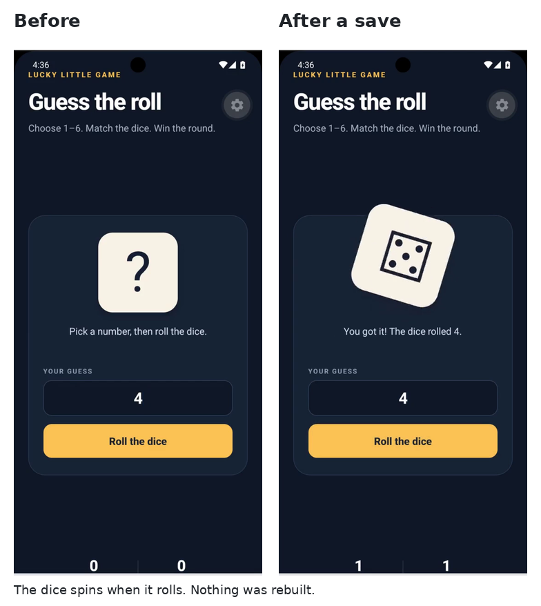

# Metro

Use Metro when the app is React Native.

## 1. Upload a development build

```bash
npx expo install expo-dev-client
```

Android:

```bash
npx expo prebuild --platform android
cd android && ./gradlew assembleDebug -PreactNativeArchitectures=x86_64
appetize build upload <apk> --wait
```

iOS, on a Mac:

```bash
npx expo run:ios
zip -r MyApp.zip MyApp.app
appetize build upload <zip> --wait
```

The upload prints an `id`. That is `<build-id>`. Older docs call it the public key.

## 2. Start Metro

```bash
npx expo start --dev-client --tunnel
```

Copy the `exp+` URL it prints. That is `<metro-url>`.

## 3. Open the app

```bash
appetize session start <device> <build-id>
appetize open '<metro-url>'
```

`<device>` comes from `appetize device list`, such as `pixel7` or `iphone15pro`.

If the Development Build launcher shows, run `open` again. Tap **Continue** if a developer menu appears.

Open the `viewerUrl` from `session start` beside your editor.

## 4. Save, then look

Save a file. The screen updates and the app stays open.


<figure><figcaption><p>After the save, the dice spins. Nothing was rebuilt.</p></figcaption></figure>

```bash
appetize session stop
```

## Without Expo

Start Metro with `npx react-native start`. On Android, `adb reverse tcp:8081 tcp:8081` points the device at it. On iOS, Metro needs a URL the simulator can reach.
