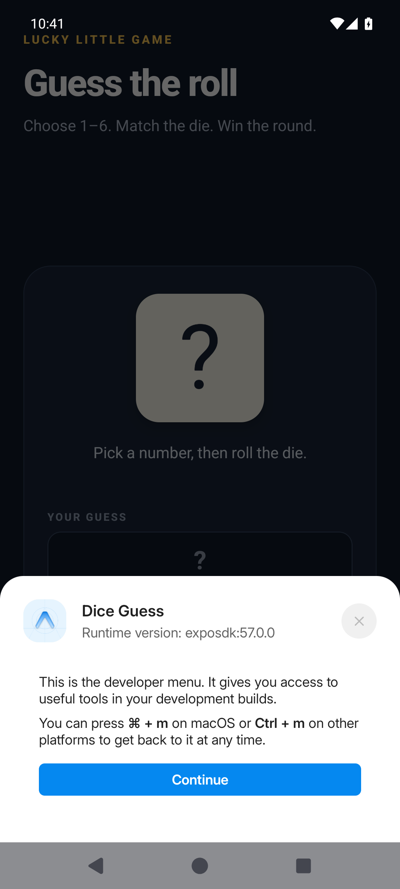

# Metro

Metro is the connection for the [AI live editing](README.md) loop with React Native. The agent saves a file. Metro sends it to the device. The agent looks, then saves again.

## 1. Make a development build

This is your app, with the Expo development client in it. It is not Expo Go.

```bash
npx expo install expo-dev-client
```

```json
{
  "build": {
    "development": {
      "developmentClient": true,
      "distribution": "internal",
      "android": { "buildType": "apk" },
      "ios": { "simulator": true }
    }
  }
}
```

Android emulators on Appetize are `x86_64`, so include that ABI:

```bash
npx expo prebuild --platform android
cd android && ./gradlew assembleDebug -PreactNativeArchitectures=x86_64
appetize build upload ./android/app/build/outputs/apk/debug/app-debug.apk --wait
```

iOS needs a simulator `.app`, zipped. Build it on a Mac, or with EAS from anywhere. Linux cannot build it.

```bash
npx expo run:ios --configuration Debug
zip -r MyApp.zip MyApp.app
appetize build upload ./MyApp.zip --wait
```

## 2. Start Metro

```bash
npx expo start --dev-client --tunnel
```

If Expo asks for `@expo/ngrok`, install it and run the command again. Leave Metro running. Copy the `exp+...` URL it prints.

## 3. Open that URL on the device

```bash
appetize session start pixel7 b_a1b2c3
appetize open 'exp+my-app://expo-development-client/?url=https%3A%2F%2Fxxxx.exp.direct'
```

Use a simulator such as `iphone15pro` for an iOS build. Put quotes around the URL.

The first launch can show a developer menu. Tap **Continue** if you see it.

<figure><figcaption><p>Tap Continue, then close the menu.</p></figcaption></figure>

`session start` prints a `viewerUrl`. Open it if you want to watch the screen.

## 4. Save, then look

Change some JavaScript or a style, and save. The device updates. The app stays open, so the agent can check the same screen instead of starting over.

```bash
appetize inspect --select-text 'Your screen title'
appetize screenshot after-edit
```

<figure><figcaption><p>The line under the title updated. Nothing was rebuilt.</p></figcaption></figure>


Stop the session when you are done:

```bash
appetize session stop
```

## If nothing changes

| What you see | What to try |
| --- | --- |
| Metro offers Expo Go | Stay on the development build. |
| The device looks for `10.0.2.2:8081` | Open the `exp+` URL from Metro. That address is the emulator, not your computer. |
| A blank screen | Wait until Metro says `Bundled`. The developer menu may be in the way. |
| The app opens, then closes | The Android build needs `x86_64`. The iOS build needs to be a simulator `.app`, not an `.ipa`. |
| A save does nothing | Check that Metro is still running and that it printed a new bundle. |
