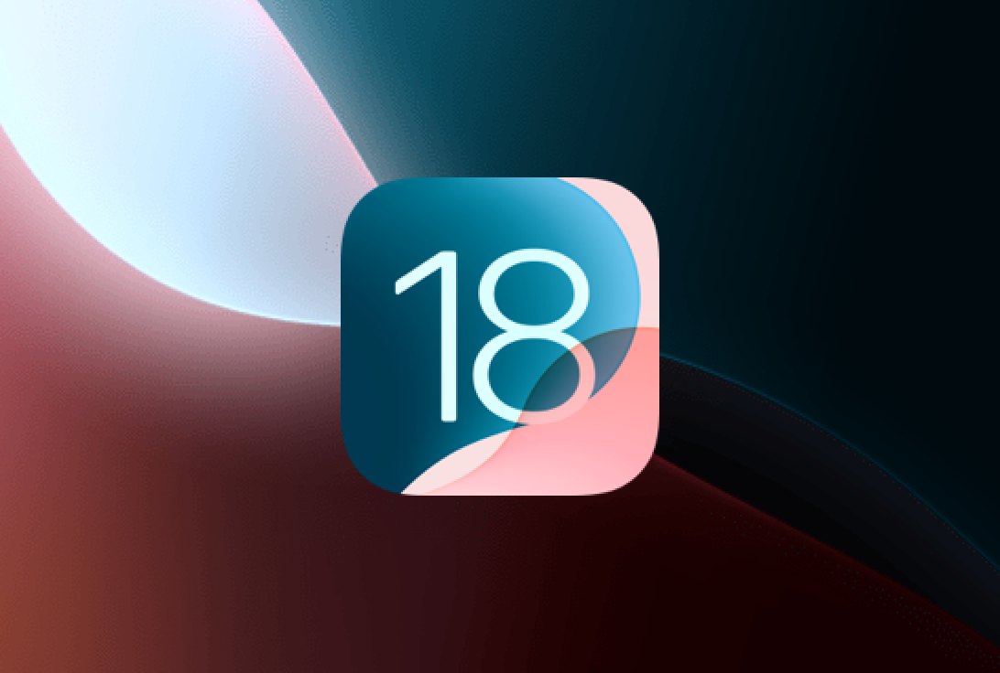

# Changelog

## September 2025

### iOS 26, iPhone 17 Support, and a New Automation Engine

<figure><figcaption>
iOS 26 &#x26; iPhone 17 devices added
</figcaption></figure>

* **New Features**
  * Added support for **iOS 26** and the latest **iPhone 17** and **iPhone 17 Pro Max** devices
  *   Launched a new **automation engine**

      * Faster, more reliable, and built to support modern declarative frameworks like SwiftUI, Compose, Flutter and more.
      * The new engine is **more integrated with the Appetize platform**, laying the groundwork for richer automation features ahead.

      [Read the announcement](https://appetize.io/blog/posts/introducing-our-new-automation-engine)
* **Bug Fixes and Improvements**
  * Added **"All iOS"** and **"All Android"** filters to easily explore sessions across entire platforms
  * Updated the **App Page** for anonymous users to match the styling of logged-in views
  * Improved support for **split APK installations** across Android devices
  * Fixed SSO configuration issues and improved fallback when multiple strategies are in use
  * Android app metadata now includes signing information for better visibility

## August 2025

### Session History View and Android 16 Support

<figure><figcaption>
New Session History View
</figcaption></figure>

* **New Features**
  * Released the new [**Session History**](https://appetize.io/sessions) view
    * Easily view, search and export previous sessions to help with debugging, tracking activity, and understanding recent usage across your team.
  * Added support for **Android 16** and **Pixel 9 devices**
    * Ensures compatibility with the latest Android OS and new device models
* **Bug Fixes and Improvements**
  * Added support for **split APKs** (including non-Bundletool) build variants.
  * Redesigned the **Build Metadata** page for clearer app build details.
  * Added **syntax highlighting** to debug logs for easier reading and troubleshooting
  * Enabled **S3 Transfer Acceleration** to speed up file uploads and downloads in supported regions
  * Added **version-based search** in the Builds view
  * Increased screenshot timeout to 60 seconds for better reliability on slower or complex apps
  * Extended accepted file types for uploads on both iOS and Android devices
  * Fixed session parameters not being saved properly
  * Improved error handling for SSO logins and duplicate email invitations
  * Resolved issues with tooltips causing duplicate clicks
  * Improved OIDC login flow, including **support for Amazon Cognito**
  * Fixed device OS selection and APK parsing issues during app installs
  * Fixed layout bugs in debug logs, toolbars, and developer settings
  * Persisted sidebar drawer state using cookies
  * Improved pointer accuracy in the Inspector tool when overlapping UI elements are present

## May 2025

### Improved User Invitation Journey & Easier API Access

<figure><figcaption>
New User Invitation Journey
</figcaption></figure>

* **New Features**
  * Introduced a [new **user invitation journey**](https://docs.appetize.io/account/invite-your-team) with predefined roles and better onboarding experience.
  * Added support for the `x-api-key` header in both v1 and v2 API authentication.
  * Enabled linking to **external launch pages** from within the Appetize App Experience.
  * Added **Pixel Tablet** to supported devices.
* **Bug Fixes and Improvements**
  * Fixed crash caused by unsafe `endSession` calls during app downloads
  * Resolved APK reinstall and upload issues
  * Improved Android emulator performance
  * Fixed memory issues caused by large app aggregations
  * Corrected issues with `lastPlayed` property updates
  * Improved iOS architecture metadata display
  * Updated email styling and fixed layout issues across login, signup, and developer tools UI

## March 2025

### Redesigned App Experience

<figure><figcaption>
Updated App Page Experience 
</figcaption></figure>

* **New Features:**
  * Web app redesign
    * The app page now includes a new toolbar for faster access to often used actions such as taking screenshots, biometric data, changing location and much more!
    * Refreshed visual design across all pages for a more consistent and intuitive experience.
  * Introduced `launchApp` parameter
    * Indicates whether an app should launch after installation, and allows specifying which installed app to open automatically.
  * Broadened device support with new Pixel 9 options and enhanced custom device configuration.
* **Bug Fixes and Improvements:**
  * Improved Android 15 support with enhancements to language changes, proxy behaviour, and general reliability.
  * Enabled Android emulators to unlock extended host CPU features.
  * Upgraded iOS runtime support to version 18.2
  * Resolved session stability issues in app groups and improved build resolution accuracy.
  * Improved UI consistency with improvements to buttons, layout spacing, tab behaviour, and component styling.
  * Strengthened federated login flows with better handling of missing user details and stricter redirect validation.
  * Corrected device-specific behaviour such as toolbar spacing and biometric icon rendering on older iOS devices.

## December 2024

### Android 15 Support

<figure><figcaption>
Android 15 Support
</figcaption></figure>

* **New Features:**
  * Support for **Android 15** on newer devices.
  * Support for multiple iOS keyboards, now configurable as an array.
  * Added **build.maxConcurrent** for enhanced concurrency management.
* **Bug Fixes and Improvements:**
  * Expanded [v1 API](https://docs.appetize.io/rest-api/create-new-app) to support additional fields:
    * `timeLimit`
    * `maxConcurrent`
    * `referrerHostnamesRestricted`
  * Android back camera now defaults to virtual scene on newer OS Versions.
  * Improved localization and framework parsing logic for iOS.
  * Fixed incorrect handling of `shiftKey` values during keypress events.
  * Resolved Android loopback issues and enhanced HTTP redirector functionality.
  * Prevented default behavior for `cmd/ctrl + K` to avoid conflicts.

## November 2024

### iOS 18 & iPhone 16 Pro/Max Support

<figure><figcaption>
iOS 18 and iPhone 16 Pro/Max support has been added
</figcaption></figure>

* **New Features**:&#x20;
  * Support for **iOS 18** and **iPhone 16** **Pro/Max** devices.
  * Improved **Organization Settings** UI with clearer section names and options.
  * **Stripe** checkout flow added for credit card updates.
  * Updated default devices to **iPhone 14 Pro** and **Pixel 7**.
* **Bug fixes & Improvements**:&#x20;
  * Fixed **video rotation** issues on Chrome 130.
  * Fixed session parameters and **configuration** handling in consecutive sessions.
  * Improved **login** redirects and federated login flow.
  * Addressed **duplicate invite token** for registered users.
  * Improved clarity for overage charges and invoice details.
  * Improved **@appetize/create-playwright** template & intro messaging.
  * **Android 5-7** have been retired due to their age and limited usage, allowing us to focus on improving compatibility with modern devices.

## October 2024

### Biometry Support for iOS, JS SDK Updates & Other Improvements

<figure><figcaption>
We now support Biometry features on both iOS and Android
</figcaption></figure>

* **New Features**:&#x20;
  * Added [biometry support](https://docs.appetize.io/javascript-sdk/automation/device-commands#biometry) for iOS.
  * Improved SDK action titles in Playwright trace sidebar.
  * Support for Google and Github Login Providers.
* **Bug fixes & Improvements**:&#x20;
  * Faster build ID validation.
  * &#x20;[ADB Tunnel](https://docs.appetize.io/features/advanced-features/android/adb-tunnel) can now be used for sessions using [AppRecorder](features/ui-automation.md), network proxies, and debug logs
  * Debug log and session info attached to test results.
  * Playwright peer dependency upgrade.
  * Fixed issue where `startSession` was not throwing errors on `userError`.
  * Resolved incorrect aliasing of `publicKey` in `EmbedWindow` class.
  * Prevented no-op on `restartApp` and `reinstallApp` for standalone session.
  * Improvements to `setLanguage` to ensure its more reliable.
  * Support for WebView scaling on iOS.
  * Improvements to Universal Link validation process.
  * Fix corrupted [Intercept proxy](https://docs.appetize.io/features/network-traffic-monitor) responses when chunked transfer encoding is used.

## July 2024

### New App Dashboard&#x20;

<figure><figcaption>
New App Dashboard: Streamlined to find the right apps faster
</figcaption></figure>

* **Enhanced App Organization**: \
  Apps are now organized by their unique application identifier. See our [App Dashboard documentation](https://docs.appetize.io/platform/app-management/listing-apps) for more info.
* **Simplified App Group Management**: \
  Easier creation and management of App Groups, with options to always use the latest build.
* **Improved Dashboard Performance**: \
  Faster load times and responsiveness, paving the way for future features.
* **Upcoming Features**: \
  Look forward to more API versatility, granular management options, and new UI automation tools.

For more information, see our [blog post](https://appetize.io/posts/updates/2024/07/03/new-app-dashboard-streamlined-to-find-the-right-apps-faster).
