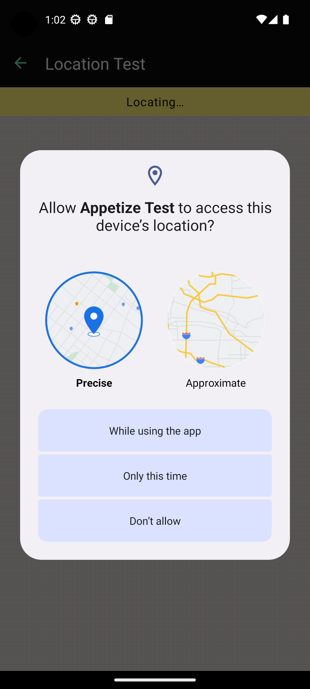

# Auto-grant permissions

## Enable Auto-grant permissions

Eliminate the hassle of manual permission grants. This feature ensures app [runtime permissions](https://source.android.com/docs/core/permissions/runtime\_perms) are automatically handled for each session. Examples of runtime permissions include location, external storage, microphone, camera, and more. Simplify your users' journey.

<figure><figcaption><p>Example runtime permission on Android</p></figcaption></figure>

It can be enabled through a query parameter or the JavaScript SDK.

### With Query Parameter

Add the `grantPermissions=true` query parameter to your app or embed URL

```uri
&grantPermissions=true
```

See [Query Params Reference](../../query-params-reference.md#grantpermissions) for more information.

### With JavaScript SDK

Set `grantPermissions: true` in the configuration e.g.

```typescript
await client.config({
    grantPermissions: true,
    ...
})
```

See [Configuration](../../../javascript-sdk/configuration.md#grantpermissions) for more information.
