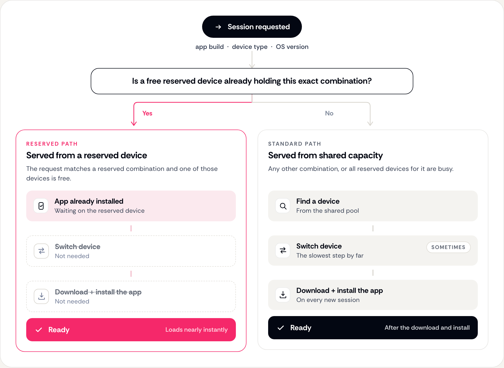
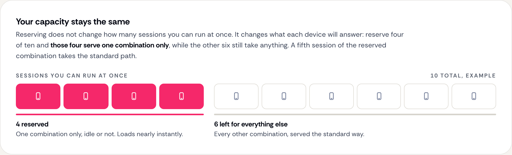

# Reserved Devices


This feature is only available on our Premium and Enterprise plans. [Contact us](https://appetize.io/contact-us) to learn more.


With reserved devices, Appetize will pre-install your specified apps onto a set of virtual devices. These devices are set aside for solely your use.

When an incoming session is requested for your app, the session can be served from one of these reserved devices, and loads nearly instantaneously for your user. The user does not need to wait for the download and installation of your app, or in rare cases needing to switch the device if the requested device is unavailable. Loading time is extremely fast.

### How a Session is Matched

A reserved device holds one exact combination: one app build, one device type and one OS version. A session is served from a reserved device only when the request matches all three and one of those devices is free.

Any other request is served from shared capacity. There the app is downloaded and installed for the session, and the device is switched if the requested one is unavailable.

<figure><figcaption><p>Where a session request goes</p></figcaption></figure>

### Reserved Devices and Capacity

Reserving does not change how many sessions you can run at once. It changes what each device will answer. A reserved device serves its own combination only, even while it sits idle, and a session for that combination that arrives when every reserved device is busy is served from shared capacity.

Reserve the combinations your team opens most often, and enough of each to cover the sessions that run at the same time.

<figure><figcaption><p>Reserved devices serve one combination only</p></figcaption></figure>

### Requesting Reserved Devices

To request a reserved device through Appetize, you need to provide specific information.

* **buildId:** Application build identifier (previously known as publicKey).
* **deviceType:** The device that is going to be reserved. e.g., iphone14pro.
* **OSVersion:** The operating system version for the device. e.g., 17.2.

See [Devices & OS Versions](../devices-and-os-versions.md) for possible device combinations.

### Accessing your Reserved Device

Once your reserved device has been configured and is ready for use, you can access it through the following URL:

Replace the **buildId**, **deviceType**, and **OSVersion** placeholders with the values provided.


```
https://appetize.io/app/{buildId}?device={deviceType}&osVersion={OSVersion}
```

