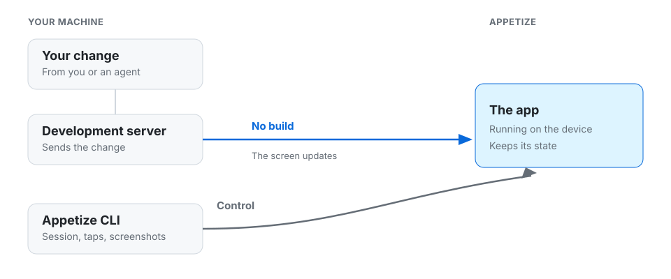
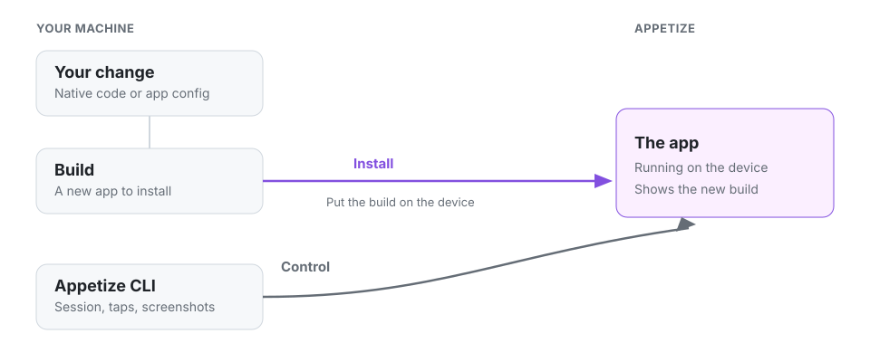

# Development loop

You can run the loop, or an agent can run the same steps.

## Hot reload

A development server sends the change to the app. There is no build, and the app keeps its state. The app on the device is a development build.

<figure><figcaption>
The blue path is the change. The gray path is you, or an agent, driving the device.
</figcaption></figure>

<table data-view="cards"><thead><tr><th></th><th></th><th data-hidden data-card-target data-type="content-ref"></th></tr></thead><tbody><tr><td>React Native</td><td>Hot reload with Metro and Fast Refresh.</td><td><a href="react-native.md">react-native.md</a></td></tr></tbody></table>

## A new build

Native code, a new native library, or app config needs a new build before the device shows it.

<figure><figcaption>
Build the app, then put that build on the device. Android and iOS each do this differently.
</figcaption></figure>
