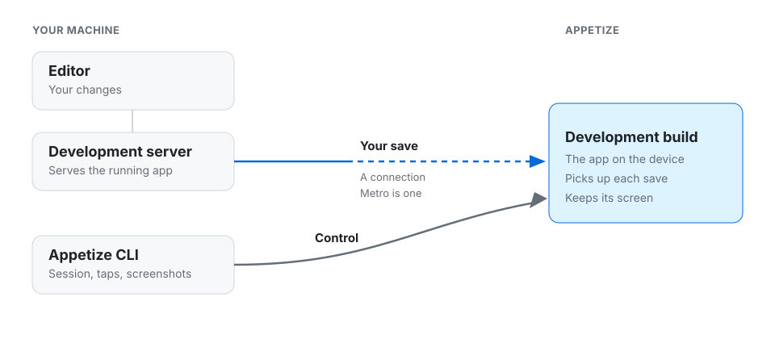

# Development loop

The app is already running on Appetize. Save a file. The screen updates. Look, then save again.

An agent does the same steps. It does not need a new build.

The update is hot reloading. React Native calls it Fast Refresh, and it keeps the app's state.

<figure><figcaption>
The blue path is the save. The gray path is you, or an agent, driving the device.
</figcaption></figure>

The save goes through a connection. The CLI starts the session and can tap the screen. It does not send the file.

Use a development build. A release build will not pick up the save.

## Learn more about

<table data-card-size="large" data-view="cards"><thead><tr><th></th><th data-hidden data-card-target data-type="content-ref"></th></tr></thead><tbody><tr><td>Metro</td><td><a href="metro.md">metro.md</a></td></tr></tbody></table>

## A new build

Upload a new build when the native app changes: a new native library, app config, or an SDK upgrade. Then keep editing.

On Android you can install that build into the open session. On iOS, start a new session with the new build. See [Sessions](../../ai-agents/sessions.md).
