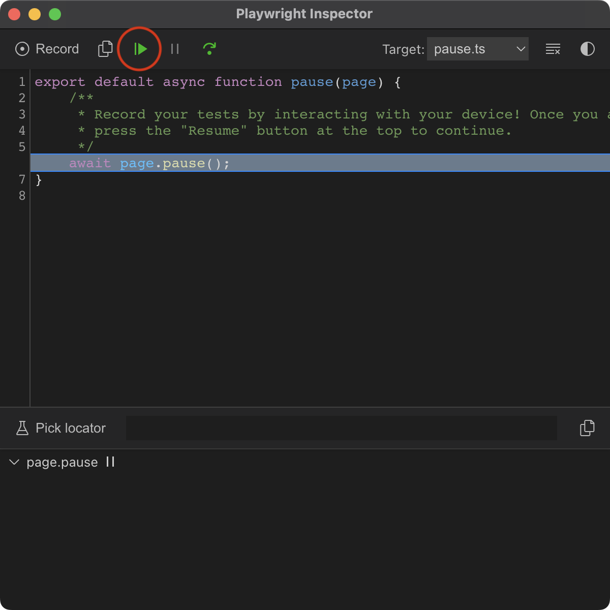

# Record Tests (experimental)


This is an experimental feature and may change or be removed in the future


Tests can be generated by recording your own interactions with the device through the browser.&#x20;

Simply add `await session.record()` anywhere in your test and then run your test in headed mode (`npx playwright test --headed`)

```javascript
test('plays back my interactions', async ({ session }) => {
    await session.record()
})
```

Playwright will pause at `session.record()` and any interactions you make on the device will be put here.&#x20;

Once you are finished, click the Resume button on the Playwright Inspector:

<figure><figcaption><p>Image of Playwright Inspector window</p></figcaption></figure>

You will see that `session.record()` has been replaced with your interactions:

```javascript
test('plays back my interactions', async ({ session }) => {
  // Recorded using session.record()
  // 1. click on element with class "android.widget.Button"
  // 2. click on element with class "android.widget.TextView"
  // 3. click on element with class "android.widget.Button"
  await session.playActions([
   ...
  ])
})
```

Run the test again and it will replay the recording.
