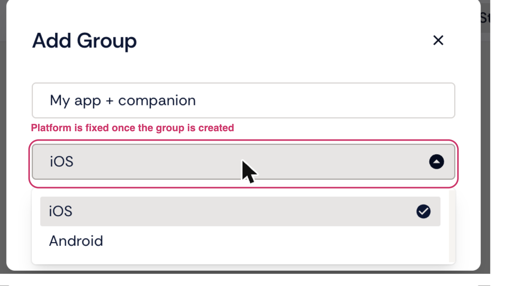
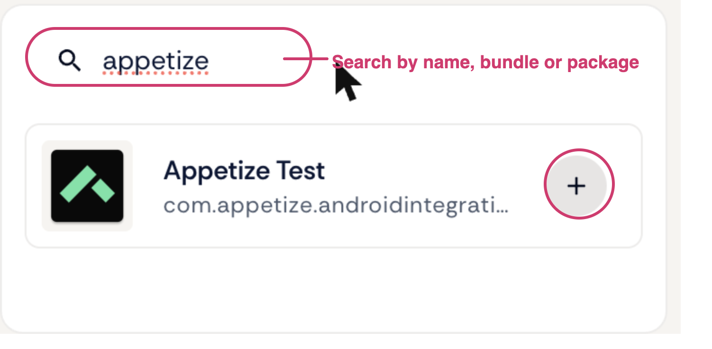
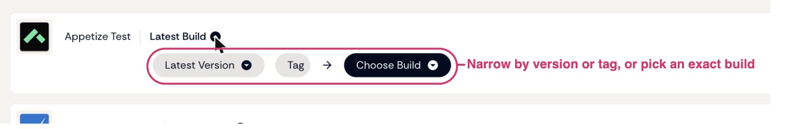

# Creating a group

App Groups live on the [Apps](https://appetize.io/apps) page, under the **App Groups** tab.

### Create the group

1. Select **Add Group**.
2. Give the group a name.
3. Choose its platform — iOS or Android.

A group is fixed to one platform, so an iOS group can only ever hold iOS apps. If you need the same set of apps on both platforms, create one group per platform.

The group is created empty.

<figure><figcaption></figcaption></figure>

### Add apps

1. Open the group and select **Add App**.
2. Search by name, bundle id or package name, or browse the list.
3. Select one or more apps.

Each app you add is listed with a build filter, set to **Latest Build** by default. A group holds up to **10** apps.

<figure><figcaption></figcaption></figure>

### Choose which build each app uses

**Latest Build** means the group always resolves to the newest build of that app at the moment a session starts, so a group keeps working as your team uploads new builds — you do not have to touch the group after every upload.

To pin something more specific, open the build dropdown next to the app. You can narrow by:

* **Version** — latest, or a specific version
* **Tag** — any tag you apply at upload time

and then **Choose Build** to select an exact build.

<figure><figcaption></figcaption></figure>

Filters are resolved per app, so one group can mix a pinned build of your app under test with the latest build of a companion app.

### Remove an app

Select the bin icon next to the app and confirm.

### When a filter stops resolving

A filter can stop matching — the build it pinned was deleted, or no build carries the tag any more. The group shows this against the app, and you can adjust the filter to match a build again.

Resolve it before you rely on the group: a group whose filter matches nothing cannot install that app, and the session will start without it.
