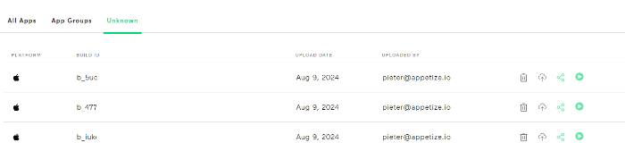

# App Dashboard


For our Enterprise customers we also provide [Custom Launch Pages](../../features/custom-launch-pages.md). They can provide a simple bookmark-friendly page for your teams, only showing the applications they are interested in.


## Single Applications


App builds hosted on Appetize are distinguished by their unique Application Identifier. On Android, this identifier corresponds to the [Application ID](https://developer.android.com/build/configure-app-module#set-application-id), while on iOS, it is known as the [Bundle Identifier](https://developer.apple.com/documentation/appstoreconnectapi/bundle\_ids).


### App Dashboard

The [App Dashboard](https://appetize.io/apps) on Appetize provides you with an overview of all your uploaded apps.

<figure><figcaption>
Apps Dashboard
</figcaption></figure>

The App Dashboard displays the [latest build](#user-content-fn-1)[^1] uploaded for a specific application. &#x20;

From there, you can:

* **Search** by application name or app identifier
* **Filter** your applications by Device Type (Android or iOS)
* Navigate to the [**App Builds**](listing-apps.md#app-builds-page) page, where you can see all the individual builds associated with your preferred application.
* **Play** the latest build associated with your preferred application.
* **Share** the latest build associated with your preferred application
* See any [**App Groups**](listing-apps.md#grouped-applications) you might have created

### App Builds Page

The App Builds page provides an overview of all the builds that was uploaded for a particular application. These are sorted by version and build information as defined by the platform.

<figure><figcaption>
App Builds page
</figcaption></figure>

From there, you can:

* See an overview of the [latest build](#user-content-fn-2)[^2] uploaded for this application
  * Easily **play**, **debug** or **share** this build
  * **Remove** this application
* **Search** for a specific build by associated metadata (e.g. version name, tag, notes and buildId)
* **Upload** a new build
* Navigate to an individual [App Build Page](listing-apps.md#app-build-page)
* **Play** the latest build associated with your preferred application.
* **Share** the latest build of your preferred application
* **Favorite** your most used apps
* See any [**App Groups**](listing-apps.md#grouped-applications) you might have created

### Build Page

The Build page provides an overview of a specific build that was uploaded to Appetize.

<figure><figcaption>
App Build Page
</figcaption></figure>

From there, you can:

* See the build identifier
* See a quick overview of the last played and uploaded dates
* See an overview of all the **build** associated **metadata**
* Add **tags** to easily identify this build
* Add a **note** to describe this build
* Easily **play**, **share** or **debug** this build

### Rest API

Appetize also supports retrieving a list of your uploaded app builds (or a single app build by **buildId**) by making use of our [REST API](broken-reference):


Each uploaded app build has a uniquely assigned **buildId** (previously known as [**publicKey**](../sharing-apps.md#public-key)**)**.

To get a specific App Build you can navigate to the [App Dashboard](https://appetize.io/apps) and open the [App Builds ](listing-apps.md#app-builds-page)page for the preferred App. Here you will be able to select individual builds that you might want to share or customize.



[list-apps.md](../../rest-api/list-apps.md)


### Unknown Builds

If a build provided to Appetize cannot be correctly processed for any reason, it will be added to the Unknown Builds page. From there, you have the option to either reupload the build, delete it, or provide the necessary information in a [Support request](https://appetize.io/support-request) so our team can investigate further.

<figure><figcaption>
Unknown Builds Page
</figcaption></figure>

## Grouped Applications

Appetize also supports grouping multiple applications that you would like to install simultaneously on the same device.


Simultaneous installation of applications with the same `App Identifier` is not possible due to conflict in identifiers.


You can view all your App Groups on the [App Group Dashboard](https://appetize.io/app-groups).

### Creating a new group

To create a new group, select the `Add group` button

<figure><figcaption>
Add Group action button
</figcaption></figure>

The new group dialog will appear, where you can:

* Enter the preferred name for the group
* Specify the associated platform of the group

<figure><figcaption>
Add Group Dialog
</figcaption></figure>

A new group will be created with no applications attached

<figure><figcaption>
New Group page
</figcaption></figure>

#### Add Applications

To add applications to the group, follow these steps:

1. Select the **Add Group** action.
2. In the **Add App** modal, either:
   * Search for your application by name or application ID, or
   * Browse the list of available applications.
3. Select one or multiple applications to add to the group.

<figure><figcaption>
Example Add App modal
</figcaption></figure>

By default, the latest build associated with the app will always be used:

<figure><figcaption>
Example of an app added.
</figcaption></figure>

To modify this, you can:

1. Click on the dropdown next to the build information (e.g., "Latest Build").
2. Specify a version and/or tags that match the build.
3. Choose a specific build or select the latest one from the dropdown menu.

<figure><figcaption>
Specify which build of an application you want by version, tag or buildId
</figcaption></figure>

#### Remove Applications

To remove any of the added applications, simply click on the trash bin icon next to the app and confirm in the dialog box that appears.

<figure><figcaption>
Example Trash Bin Icon next to app
</figcaption></figure>

<figure><figcaption>
Remove App Confirmation Dialog
</figcaption></figure>

### Unknown builds

If a build filter specified in an App Group can no longer be found or resolved, this information will appear at the bottom of the App Group. You can then remove or adjust the filter to find a new matching build.

<figure><figcaption>
App Build Filter not found example 
</figcaption></figure>

### Playing and embedding your App Group

Once you have added all the applications to the group, you can use the group in the same way that you would have used the individual applications (e.g. play, embed etc.). You can view all your App Groups on the [App Group Dashboard](https://appetize.io/app-groups).

<figure><figcaption>
Example App Group
</figcaption></figure>

[^1]: The **latest build** refers to the most recent version of your app on Android, identified by the [versionCode](https://developer.android.com/studio/publish/versioning#versioningsettings) , and on iOS, by the [CFBundleShortVersionString](https://developer.apple.com/documentation/bundleresources/information\_property\_list/cfbundleshortversionstring) and [CFBundleVersion](https://developer.apple.com/documentation/bundleresources/information\_property\_list/cfbundleversion).

[^2]: The **latest build** refers to the most recent version of your app on Android, identified by the [versionCode](https://developer.android.com/studio/publish/versioning#versioningsettings) , and on iOS, by the [CFBundleShortVersionString](https://developer.apple.com/documentation/bundleresources/information\_property\_list/cfbundleshortversionstring) and [CFBundleVersion](https://developer.apple.com/documentation/bundleresources/information\_property\_list/cfbundleversion).
