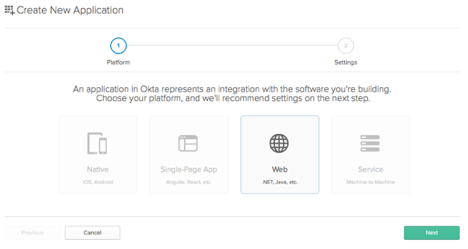

# Session Inactivity Timeout

By **default**, your Appetize session will end after **2 minutes** of inactivity. You can modify the default app timeout, or specify a timeout for a specific app by following the steps below:

## Default App Timeout

Navigate to your [**Account Dashboard**](https://appetize.io/account) **->** **Default app settings** -> **Default inactivity timeout**

<figure><figcaption>
Default App Inactivity Timeout
</figcaption></figure>

## App Specific Timeout

Navigate to your [**App Dashboard**](https://appetize.io/apps) **-> Manage** (under your preferred app) **-> Session timeout**

<figure><figcaption>
Select "manage" under your preferred app
</figcaption></figure>

<figure><figcaption>
App specific Inactivity Timeout
</figcaption></figure>


You can also[ set](../rest-api/create-new-app.md)/[update](../rest-api/update-existing-app.md) the inactivity timeout of your app with our [REST API](broken-reference) when uploading your app.


