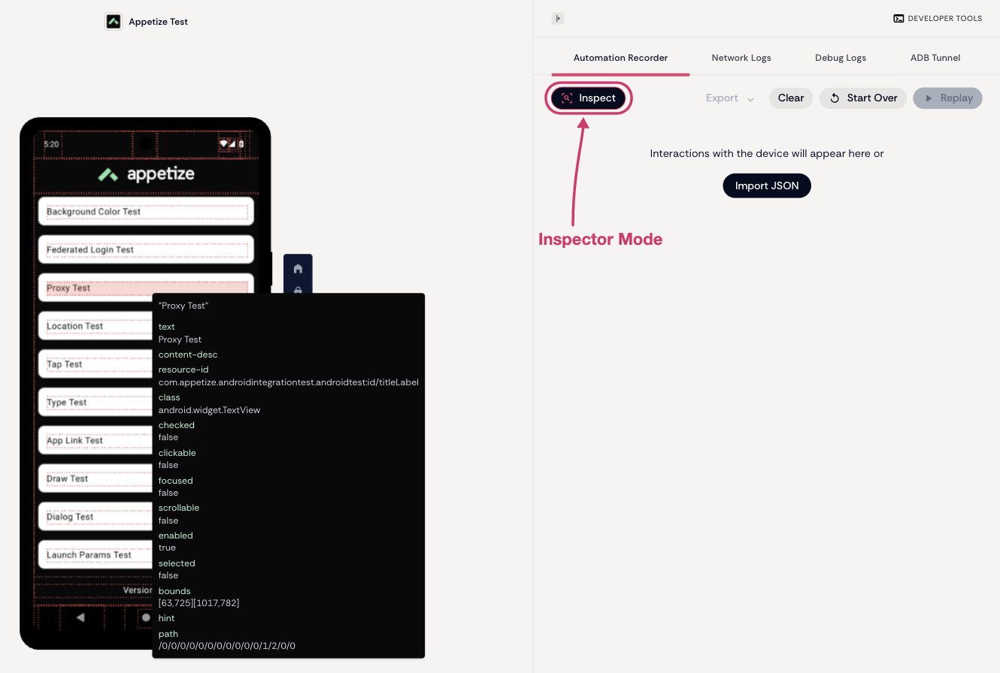

# Testing

## What is Appetize Automations for Playwright?

Appetize Automations for [Playwright](https://playwright.dev/) is an integration that brings the power of Appetize's Mobile UI automation framework to Playwright. It allows you to easily build, run and debug tests on Appetize devices while benefitting from the many tools that Playwright offers.

<figure><figcaption>
Playwright with Appetize AppRecorder in action
</figcaption></figure>

## **Why Should I Use Playwright with Appetize Automations?**

### **Platform-independent**

**Appetize Automations** is built to be platform-independent, supporting all major mobile app development frameworks (React Native, Flutter, KMP, Native, etc.)

### **Unified Testing Solution**

The Playwright integration with Appetize provides a unified testing solution familiar to web teams, enabling seamless testing across mobile, [mobile-web](web-tests-on-mobile-browsers.md), and web applications.

### **Ease of Use**

**Appetize Automations** is designed to be familiar and easy to use, featuring an inspector tool for debugging and understanding the app under test, along with a low-code automation tool to help you get started quickly.

#### Inspector Mode

Inspector Mode overlays the running app with its UI hierarchy. Hover or tap any element to see its attributes — text, `resource-id`, `class`, bounds, and whether it is clickable, enabled or scrollable — so you can pick a selector that matches what is actually on screen.

Turn it on with **Inspect**, in the Automation Recorder tab of the Developer Tools panel, while a session is running.

<figure><figcaption></figcaption></figure>

### **Consistent and Reliable Test Environments**

All tests are run in the Appetize environment, ensuring consistent behavior and results whether executed locally or through CI/CD pipelines.

### **Quick Test Execution**

Experience fast app launches (as quick as 4 seconds) and efficient test execution with built-in support for concurrency.

### Benefit from the many tools that Playwright offers

Leverage Playwright's powerful tools, including the [Trace Viewer](https://playwright.dev/docs/trace-viewer-intro), [CI configurations](https://playwright.dev/docs/ci), and the [VS Code extension](https://playwright.dev/docs/getting-started-vscode). See the [Playwright documentation](https://playwright.dev/docs/intro) for more information.

## Getting Started

Visit our Getting Started section to begin:


[getting-started.md](getting-started.md)

